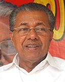
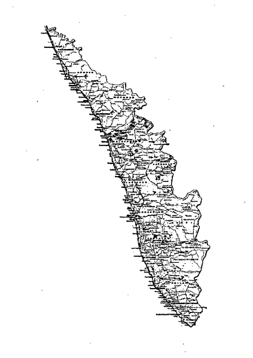

<!-- START doctoc generated TOC please keep comment here to allow auto update -->
<!-- DON'T EDIT THIS SECTION, INSTEAD RE-RUN doctoc TO UPDATE -->
**Table of Contents**  *generated with [DocToc](https://github.com/thlorenz/doctoc)*

- [I.T. Policy Framework 2017](#it-policy-framework-2017)
- [Message from the Chief Minister](#message-from-the-chief-minister)
- [VISION](#vision)
- [1. Introduction](#1-introduction)
- [2. Kerala IT Policy Framework 2017 - Elements](#2-kerala-it-policy-framework-2017---elements)
  - [2.1. Objectives](#21-objectives)
  - [2.2. Drivers of the Policy](#22-drivers-of-the-policy)
  - [2.3. Policy Outline](#23-policy-outline)
    - [2.3.1. E-Governance Team Structure](#231-e-governance-team-structure)
    - [2.3.2. Human Capital Development](#232-human-capital-development)
    - [2.3.3. Marketing](#233-marketing)
    - [2.3.4. Infrastructure and Foundational Capabilities](#234-infrastructure-and-foundational-capabilities)
  - [2.4. Governance Structure](#24-governance-structure)
    - [2.4.1. Digital Government Advisory Board](#241-digital-government-advisory-board)
    - [2.4.2. IT Secretary](#242-it-secretary)
    - [2.4.3. E-governance](#243-e-governance)
    - [2.4.4. IT Parks](#244-it-parks)
    - [2.4.5. Human Capacity Development](#245-human-capacity-development)
    - [2.4.6. Infrastructure Development](#246-infrastructure-development)
    - [2.4.7. KPIs and Measures of Success](#247-kpis-and-measures-of-success)
  - [2.5. Focus areas](#25-focus-areas)
  - [2.6. Sub policies and Guidelines](#26-sub-policies-and-guidelines)
- [3.Digitally Empowered Citizens](#3digitally-empowered-citizens)
  - [3.1. Digital Identity](#31-digital-identity)
  - [3.2. Participatory E-governance](#32-participatory-e-governance)
  - [3.3: Single Government Portal](#33-single-government-portal)
  - [3.4. FOSS adoption and promotion](#34-foss-adoption-and-promotion)
  - [3.5. Government Service Delivery](#35-government-service-delivery)
  - [3.6. E-services](#36-e-services)
  - [3.7. Citizen Service Centres](#37-citizen-service-centres)
  - [3.8. Mobile Governance](#38-mobile-governance)
  - [3.9. e-Procurement system of Kerala](#39-e-procurement-system-of-kerala)
  - [3.10. Smart Villages / Panchayats](#310-smart-villages--panchayats)
  - [3.11. Financial Inclusion and Mobile Banking](#311-financial-inclusion-and-mobile-banking)
- [4. Digitally Empowered Lifestyle](#4-digitally-empowered-lifestyle)
  - [4.1. Digital Literacy](#41-digital-literacy)
  - [4.2. Connected Education Hubs](#42-connected-education-hubs)
  - [4.3. Local networks](#43-local-networks)
  - [4.4. Local Content](#44-local-content)
- [5.Digital Commerce](#5digital-commerce)
  - [5.1. Policy for e-commerce](#51-policy-for-e-commerce)
  - [5.2. Mobile commerce](#52-mobile-commerce)
  - [5.3. E-business facilitation](#53-e-business-facilitation)
  - [5.4. Innovation and entrepreneurship](#54-innovation-and-entrepreneurship)
  - [5.5. Establishing the Technology Innovation Zone](#55-establishing-the-technology-innovation-zone)
  - [5.6. Grand Innovation Challenge](#56-grand-innovation-challenge)
  - [5.7. Industry development and Job creation](#57-industry-development-and-job-creation)
  - [5.8. Promotion of hyperlocal platforms](#58-promotion-of-hyperlocal-platforms)
  - [5.9. Kerala App Store](#59-kerala-app-store)
  - [5.10. IT Industry facilitators](#510-it-industry-facilitators)
  - [5.11. Domestic Marketplace](#511-domestic-marketplace)
  - [5.11.1. Government procurement](#5111-government-procurement)
  - [5.11.2. Promotion of locally manufactured/assembled products](#5112-promotion-of-locally-manufactured assembled-products)
  - [5.12. Brand 'Kerala IT'](#512-brand-kerala-it)
    - [5.12.1. Delegations](#5121-delegations)
    - [5.12.2. IT Expo Kerala](#5122-it-expo-kerala)
    - [5.12.3. International Seminars](#5123-international-seminars)
    - [5.12.4. Encourage high achievers](#5124-encourage-high-achievers)
- [6. IT & Ancillary Infrastructure](#6-it--ancillary-infrastructure)
  - [6.1. State IT Infrastructure](#61-state-it-infrastructure)
  - [6.2. IT Industry and allied Infrastructure](#62-it-industry-and-allied-infrastructure)
  - [6.3. IT Infrastructure (Network and Data centre)](#63-it-infrastructure-network-and-data-centre)
  - [6.4. Fab Labs](#64-fab-labs)
  - [6.5. Global Cognitive Fabric](#65-global-cognitive-fabric)
  - [6.6. Mobile access for underprivileged families](#66-mobile-access-for-underprivileged-families)
  - [6.7. Mobile devices for women safety](#67-mobile-devices-for-women-safety)
  - [6.8. Cyber Security](#68-cyber-security)
  - [6.9. Business Continuity](#69-business-continuity)
  - [6.10. Free Wi-Fi in public places & IOT enabling](#610-free-wi-fi-in-public-places--iot-enabling)
  - [6.11. Government Missions](#611-government-missions)
  - [6.12. Haritha Keralam](#612-haritha-keralam)

<!-- END doctoc generated TOC please keep comment here to allow auto update -->

# I.T. Policy Framework 2017

This document contains the Information Technology Policy Framework of the Government of Kerala

---

# Message from the Chief Minister

With the most pleasure I am presenting the IT policy framework of the Government aiming to boost the IT sector driven economy in the State. The Policy of the Government is to make use of the digital technology for the overall development of the State and to ensure quick and efficient delivery of all essential services. The State has the potential to bridge the digital divide prevalent.

Kerala has a strong infrastructure and human resource strength to adopt digital facilities. Educated people, moderate standard of living etc. are all facilitating factors. We need to leap forward attracting substantial investment in IT sector and identifying and promoting young entrepreneurs through start ups.

Digital technology is imperative not only for the development of modern industries but for the general well being of the State also. This is possible through three ways. Firstly when I.T. is integrated with manufacturing sector its efficiency increases. Rendering of Government service to people efficiently is the second possibility. Thirdly, employment opportunities can be generated by using the possibilities in software development and hardware production. This will help realize the government intention of laying a strong foundation for a vibrant new Kerala.

An efficient governance system is essential to ensure - accelerated industrial growth and implementation of novel and creative schemes. The unlimited opportunities of internet of things, social media, mobility analytics and cloud computing will give a boost to conceiving and articulation of new ideas. Moreover the thrust of government in infrastructure development, human resource development and overall economic development will open up large opportunities for the meaningful use of Information Technology and make these initiatives effectively comprehensive.

It is indeed commendable to find that more than 90% of Keralites have been enrolled in the Aadhaar card programs. In this context government intends to implement the KYC facility through Aadhaar based biometric system. At the same time e-Services of government would not be denied to citizens for want of Aadhaar and it will be ensured through other basic proofs of identity.

For the first the the government intends to publish a sub policy statement relating to various sections along with the main document. It is proposed to update the sub policy documents in an yearly interval to ensure refining the same on the basis of the fast changing scenario in technology and its applications.

Another speciality of this draft document is that it allows the public and experts in the field to contribute their suggestions and inputs, which shall be examined on merit and appropriately incorporated in the final document.

Let us all work together to create a 'NAVAKERALAM'.

# VISION

Establish Kerala a Knowledge Powered Digital Society by 2020 through application of Digital Technologies in areas of Digital Citizenship, Digital Lifestyle and Digital commerce; within the governing principles of Freedom, Ubiquity, Inclusion, Transparency, Safety and Security for all; aligned to technology trends, citizen and industry needs; to provide overall social and economic empowerment of citizens

# 1. Introduction

The State of Kerala has always been working towards adoption and application of Information & Communication Technology (lC) be it the services/support to its citizens or enabling smoother functioning of the business community. Numerous initiatives have been taken up over the years, which have enabled the State to intervene effectively in implementing ICT projects and to be a pioneer in E-governance activities.

The State has been successful in creating a robust Electronics Delivery of Service infrastructure in terms of State wide area network, Data centers and citizen service centers. There has been a good amount of work that has gone into creating a sustainable model for Akshaya, the network of IT entrepreneurs who work under the Brand on a license agreement to deliver public services. Akshaya is one of the most lauded and successful citizen service delivery center models in the country and in the world. The centrally monitored but loosely structured governance mechanism gives it the flexibility and operational nimbleness and at the same time ensures the security and authenticity of public service delivery.

Even though the first IT park and first electronic enterprise were started in Kerala , today we lag behind in software exports and electronics industry. Kerala needs to create a change to make a quantum leap in innovative technologies and to accelerate growth in the above areas. The policy aims to generate projects which will mould Kerala into a Knowledge based society.

## 1.1 Kerala IT - snapshot

Government of Kerala recognizes the critical importance of ICT as the key vehicle for the State's overall equitable development and reiterates its commitment to the sector. The State Government announced its first IT Policy in 1998. The subsequent IT policies have helped Kerala to achieve unique distinctions of a preferred IT/lIES investment destination and also in promoting e-governance initiatives.

The agenda of Kerala IT Policy is to lay the goals of establishing Kerala as a leading IT destination and generating direct and indirect employment opportunities in the IT sector. Specifically, the goals of the IT policy include building of necessary technological infrastructure for creation of an environment favorable to ICT development; enhancing the necessary human capital required to both produce and use innovative technologies through education and skill building; and establishing. Kerala as an IT industry destination by attracting investments from within and outside the region. Kerala has a 4 pronged strategy for IT development in the State:

1. World class technology infrastructure creation
2. Human capacity building for generation and consumption of future technologies through Technology education , skill development
3. Time bound and modern marketing systems to attract Domestic and Foreign investments and leverage the growing internal market.
4. Ensuring that citizen services are made available effectively and create a citizen centric digital economy dovetailing innovative ideas and the vibrant startup ecosystem.

# 2. Kerala IT Policy Framework 2017 - Elements

## 2.1. Objectives

1. Establish Kerala as a preferred IT & ITES hub particularly in innovation, based technologies and leverage ICT to contribute significantly to GDP and to attract employment.
2. Device Schemes to the Global IT players to the Parks in Kerala.
3. Create 1 crore Sq ft office space so as to provide employment directly.
4. Utilize the capabilities of the cooperative sector and the capital from diaspora (NRIs) to develop the Parks.
5. Maintain a steady annual growth in exports of IT & ITES service and products.
6. Create a Science & technology driven ecosystem for R&D and Innovation to make Kerala a Knowledge society.
7. Increase the quality and competitiveness of the small and medium IT enterprises and intervene to connect them to the international market.
8. Foster technology entrepreneurship culture and create a sustainable Startup ecosystem by creating technology hubs.
9. Provide inclusive, affordable and accessible Electronic Service delivery system for public services. E-governance projects to be completed in a time bound manner and made it under the purview of social audit.
10. Ensure Universal Open access to data, information and knowledge resources in a digital domain. Enable access of content and ICT applications to the differently-abled.
11. Make the state 100% e-literate and utilize ICT in all walks of life to ensure equitable and inclusive development of the society.
12. Give special emphasis to and promote research and development in Malayalam language computing , and develop tools for the same
13. Build a connected ecosystem of academic institutions leveraging Telepresence and Audio Conferencing, Online Portals and App based learning.
14. Develop a talent pool within the state in skills for sunrise industries and human resource capabilities for emerging and futuristic technologies. Create talent pool of additional resources and increase the ICT employability index.
15. Make IIIT-MK and ICFOSS Centers of Excellence for research and development and studies in IT sector.
16. IT@School shall be strengthened and its experience shall be used to develop schemes for Higher education.
17. Create a safe framework for digital living in terms of cyber security, privacy and freedom of internet , conduct training and awareness programs and promote electronic transactions.
18. Leverage IT in the day to day operations and in delivery of services in Hospitals. Government hospitals shall be computerized and shall be connected through a network. The patient data shall be collected and utilized for effective planning and implementation of health activities while ensuring the privacy of citizens.
19. Adopt open source and open technologies in public domain and promote the same in SMEs and industry.
20. Manufacturing of electronics goods/components will be made possible among all (including housewives) by utilising schemes to transform the State to an electronic hub in the field Of electronics production.
21. Strengthen the operation of Keltron so as to regain the prominence it had in the past and adopt modernization and R&D to matchup with the developments in the Science and Technology Fronts.
22. R&D institutions shall be established in areas of convergence of IT and Bio Technology and the technologies shall be utilized to improve the quality of exports in fruits, vegetables fish and spices from Kerala

## 2.2. Drivers of the Policy

1. Technology Trends & Innovation - the policy shall attempt to leverage current / futuristic technologies like Massive Open Online Courses (MO005), Artificial Intelligence, Smart home & City technologies, etc., to improve citizens' service and being responsive to the industry on technologies like Robotics, Flexible electronics and Power electronics, Wearable technologies , Autonomous Vehicles-3D printing, Virtual currencies, Aquaponic systems etc.
2. Citizen services - The policy will focus on the constant demand and expectation by the citizens in terms of a single sign in for Government interactions, Digital government and Right to Service. It will be designed to accommodate futuristic needs of the people.
3. Industry Needs - The industry has been requesting a favorable consideration for assistance in creating cost effective infrastructure for "work and life', updated university curriculum for availability of qualified employees and support and assistance for destination competitiveness.
4. Novel ideas and endeavours will be promoted and its effective facilitation will be ensured in diverse production sectors.

## 2.3. Policy Outline

Detailed policies for respective areas will be created by the various bodies responsible for e-Governance, Human Capital, Commerce and Infrastructure. The roles and responsibilities of the existing governance systems leveraging IT will have to be redefined as per the new policy.

### 2.3.1. E-Governance Team Structure

This team shall own the Digitization of Government departments and Citizen empowerment activities.

Involvement of citizens in the Digital Economic systems of the government , creation of smart village /panchayat , empowerment of schools ,backward groups/differently abled etc will be realized through this. This group will cover the formulation of policies aligned to this.

### 2.3.2. Human Capital Development

This group shall focus on developing Digital talent in the state in all key areas including loT, Mobility, Analytics and Software development, high end embedded electronics, cognitive awareness etc. Partnering with schools, technical education institutions and broader academia is planned to achieve these goals. If needed, new institutions shall be established and managed to meet the goals of the state.

### 2.3.3. Marketing

This group drives the demand for IT I ITES and focus in bringing global industries and developing IT industries in Kerala through innovation and acceleration capabilities. Sustainable entrepreneurship development shall be the mandate of this group.

### 2.3.4. Infrastructure and Foundational Capabilities

These groups shall drive all the digital and physical Infrastructure needed for realisation of Digital Kerala. Disaster recovery, Mobile, Wifi and Fibre connectivity shall be part of this team. IT parks infrastructure, interconnectivity facilitation etc. shall be driven by this group.

## 2.4. Governance Structure

The policy envisages a lean and structured organization in the state for the implementation of the policy. Each individual units will frame their clear roles, responsibilities and structure, which will form part of the sub policies and guidelines

State IT minister shall play the lead role in the development of Information technology and related activities in the state. l.T Minister shall preside over the Board of advisor's meetings and obtain approval from the council of ministers, if necessary, on key issues.

### 2.4.1. Digital Government Advisory Board

The Digital Government Advisory Board shall be made up of a handful of eminent experts from IT, Telecom and other related domains having proven track records in delivering digital products and services connecting a large user base.

The Board will meet on a quarterly basis and will support and advise the government to deliver better services to citizens and corporates. The Board will also evaluate how emerging digital technology trends can be applied to public services. The Advisory Board would act as a Technical advisory which brings in the expertise and knowledge of the industry and the futuristic trends.

This Advisory Board shall work in liaison with the elected and (.) appointed leaders of the state to drive comprehensive, cohesive, concerted IT efforts in the state and bring all digital/IT related activities under a common governance. This Board will help with the formulation of guidelines, updated framework and governance model for project execution. The Board would also monitor the timely, efficient execution of projects and services in a time-bound and transparent manner.

### 2.4.2. IT Secretary

The IT secretary shall be the senior designated officer in the state who own both the demand as well as the supply of Digital services and resources of the Government The various agencies under the IT department shall be restructured into the following four categories

### 2.4.3. E-governance

This role of IT mission director has to be redefined to fit the new model of e-Governance Head of the State. IT Mission shall take lead in all the e-governance activities in the state. IT Mission shall, directly and through sub agencies like SEMT, support the e-governance projects in Govt. departments.

### 2.4.4. IT Parks

This role of IT parks has to be redefined to fit the new model of IT assets and Commercial agencies of the state. The activities of all IT parks (Techno park, info park and Cyber park) shall be consolidated under the single brand 'Kerala IT ' and optimally use the resources (human capability , material, other revenue and assets).

### 2.4.5. Human Capacity Development

The combined efforts of the agencies like ICT academy , IIIT-MK, ICFOSS and KSUM is required for IT human capacity building , skill development , institutions of higher studies , excellence in FOSS and Startup development.

### 2.4.6. Infrastructure Development

KSITIL shall be transformed into an agency for all Infrastructure development in IT sector and all construction, connectivity activities etc. shall be carried out through it.

### 2.4.7. KPIs and Measures of Success

This has to be defined for each group.

## 2.5. Focus areas

The Policy mainly focuses on three areas viz.,

 - Digitally empowered Citizens,
 - Digitally empowered Lifestyle and
 - Digitally empowered Commerce

These three areas shall between them cover the entire gamut of activities and functions under the department which will enable the state attain its vision of a Knowledge Empowered Digital Society.

## 2.6. Sub policies and Guidelines

The following Sub Policies and Guidelines shall be prepared in line with the direction of the IT policy

1. Electronic governance Policy
2. Industry Facilitation policy
3. Digital Inclusion Guidelines
4. FOSS policy
5. Innovation and Entrepreneurship Policy
6. Digital Capacity Building Policy
7. Digital Procurement policy
8. Cyber security and Disaster Recovery Guidelines

# 3.Digitally Empowered Citizens

## 3.1. Digital Identity

1. The Government shall initiate action for universal Aadhaar enrollment linking all government data bases.
2. The government shall empower citizens to access government services through mobile devices for getting government services.
3. Aadhar based biometric authentication shall be used for KYC purposes and it shall be used for direct disbursement of subsidies and benefits. However in the absence of Aadhar the services shall be given to citizens on the basis of other basic documents. No government services shall be declined for want of Aadhar.

## 3.2. Participatory E-governance

1. Government shall ensure that the citizen government interface shall be through a single government Portal
2. The entire file movement in government secretariat and departments shall be made digital
3. The backend computerization of the departments and the extended offices, PSU5 etc shall be achieved in a time bound manner.

## 3.3: Single Government Portal

The Government shall create a single portal for citizens interactions with government and service delivery. The citizen interactions viz., service delivery, grievance /complaints and payment transactions of all departments shall be converged through a single portal. The portal shall be the face of the Government to the citizen and business

## 3.4. FOSS adoption and promotion

The Government has adopted the Free and Open source technologies as one of the basic guiding principles and shall strive for the promotion and adoption of the same. The Government shall make it mandatory for all software solutions made through public funding to adopt free and Open source technologies. Activities to achieve the objectives of IT policy 2007 in these matter shall be taken up.

## 3.5. Government Service Delivery

State is embarking on its journey to offer an "Omni-channel experience" of all its e-Governance services through web portal, mobile applications, Akshaya I CSCs and through Integrated Citizen call centres. The objective is to set up and operationalise an effective Single Window for services supported by the core infrastructure and systems. It shall be ensured that all government applications are compliant to Deity guidelines and thereby interoperable.

## 3.6. E-services

Government shall attempt to make online, as many services as possible and high volume shall be made across the counter services. Certificates of a one-time issue nature shall be proactively done and kept in a state digital repository with easy search and retrieve provisions. The State shall also attempt to move on to a certificateless system wherein the citizen data is automatically retrievable by the user's system from a common citizen database. Common utility centres shall register the public feedback and corrective measures will be undertaken promptly.

## 3.7. Citizen Service Centres

The Akshaya has performed a commendable role by bringing government services to people and business, units, functioning as a single window system. In the journey towards a more matured, complete and comprehensive citizen service delivery center, the Government shall transform the Akshaya eco system into state-of-the- art centres in citizen centric service delivery and centres of excellence in ICT enabled services. Majority of services shall be offered via the Citizen Service Centers.

## 3.8. Mobile Governance

To provide the e-Governance services at the fingertips of citizens, Kerala is adopting mobile first approach for e-Governance services in line to Digital Kerala Vision by leveraging high mobile penetration and Coverage in the state. Malayalam shall be the basic language in these applications and shall also have English and languages of other language minorities. The objectives of Mobile Governance are:

1. Enable mobile services for ease of access to e-Governance services from existing e-Governance systems.
2. Adopt mobile first approach for new systems or services offered.
3. Enable additional utility services through mobile for ease of access to citizens
4. To leverage mobile as one of the media to communicate and interact with citizens. 5. Leverage jOT and Social Media for effective planning and delivery of services.

## 3.9. e-Procurement system of Kerala

Government of Kerala has implemented the e-Government procurement system to enhance transparency and efficiency in public procurement activities and monitor the same on a real-time basis. This shall follow the Government e Marketplace model to make government. procurements online.

## 3.10. Smart Villages / Panchayats

Growth of the State and nation depends on its inclusive growth of rural and urban population. Kerala is.planning for a focused programme to enable the inclusive growth of the state through its Smart Village/Panchayat Programme I

## 3.11. Financial Inclusion and Mobile Banking

1. The Government shall ensure reach of financial services to all ensuring inclusion of citizens of all strata to such endeavours.
2. Online and Mobile Banking shall be adopted for all Government transactions with citizens.

# 4. Digitally Empowered Lifestyle

## 4.1. Digital Literacy

Human capital is undoubtedly the most significant resource for the IT sector. There has been some robust steps towards bridging the gap between academia and the industry to create employable manpower. However, more initiatives in this sector will be taken to attract companies to start/augment their operations in Kerala.

1. Strengthen the ICT Academy
 - Build partnerships with renowned international universities/certifying bodies
 - Infuse entrepreneurship in the engineering curriculum
 - Encourage use of free online learning resources from leading universities like MIT and learning platforms
 - Provide guidelines to the curriculum committees for identifying the right online courses
2. Map industry acclaimed online courses/certification to University curriculum
3. Delivery of Courses integrating IT with nanotechnology and biotechnology shall be started and R&D in this area to be promoted
4. Industry-Academia linkage to ensure mandatory internship for IT students. Incentivize IT companies complying with the idea.
5. Creation of Centres of Excellence in IT education.
6. Develop ICFOSS to an International center for FOSS studies.
7. Develop action plans leveraging ICT to increase the employment possibility and betterment of lifestyle of differently abled

## 4.2. Connected Education Hubs

Technology Education centers will be interconnected through telepresence, video conferencing, and audio conference capabilities. Learning portals will be established to enable remote education

## 4.3. Local networks

Encourage and support community relevant applications covering security of citizens, health, revenue, taxes, etc. Community connect - open governance model for increased citizen H participation in the administration of the district city specifically and governance in general.

## 4.4. Local Content

1. Creation of local content and localization of newer technology and content for the general public
2. Create a center for Malayalam Computing with the support of Thuchath Ezhuthachan Malayalam University
3. Support the cause of Malayalam computing through the community partners like Swathantra Malayalam Community etc Government to initiate action to increase the content of Malayalam in Wikipedia
4. Create a repository for the source codes and documentation for all projects developed for government.

# 5.Digital Commerce

## 5.1. Policy for e-commerce

The government shall enact a policy for the enablement of growth of e- commerce in the state. This shall cover the rules and regulations on the ecommerce Industry

## 5.2. Mobile commerce

M-commerce is enabling us to transact commercially from anywhere over the Internet without the use of a PC. M-commerce is the logical continuation of e-commerce and is enabled by the proliferation of smart mobile devices and better connectivity. Government will facilitate this process through enhanced

1. Communications Infrastructure
2. Applications Infrastructure, and
3. M-commerce Intermediary

## 5.3. E-business facilitation

Government shall encourage and facilitate the conduct of business processes on the Internet be it 13213 or 132G. These include buying and selling, supplies and services; (including government procurement of Goods and services), processing, payments; managing production, collaborating with partners, information sharing and any other business functions. Government shall encourage StABs to move to a shared infrastructure and Software as a Service to reduce their cost and become more efficient.

## 5.4. Innovation and entrepreneurship

The Government of Kerala wishes to leverage the developments in IT sector and the startup sphere to kick start the next phase of innovation and entrepreneurship movement in the state. The government wishes to adopt a cognitive approach to innovation and entrepreneurship development. The ability to think critically and to solve problems in scientific and technological contexts is an essential skill for entrepreneurs working to solve society's critical problems. Government wishes to address this through

1. Creation of an Innovation Ecosystem.
2. Facilitating the innovation led entrepreneurship especially among students
3. Involve Industry /R&D institutions

## 5.5. Establishing the Technology Innovation Zone

The Kerala Technology Innovation Zone shall be established to cater to the needs of the innovation and entrepreneurial startup ecosystem. This is.to ensure that there can be

1. Accumulation of critical mass of talent and entrepreneurs
2. Connect to the Global ecosystems and Research and innovation networks
3. Requisite resources and ambience is available with nimbleness of operations
4. Presence of State of the Art labs and other Infrastructure

## 5.6. Grand Innovation Challenge

The Government shall constitute a Grand Innovation Challenge for the upcoming startup ideas on an annual basis and the winner shall be provided sufficient funding and support to realize the idea.

## 5.7. Industry development and Job creation

Development of IT Industry is one of the key factors in helping the state move into a knowledge economy and facilitating faster technology adoption. There needs to be sufficient thrust to project the state as an ideal location for the industry, given its advantages of healthy environment, better law and order situation, lower cost of living and operations etc. Government shall focus on creating enough jobs that suits the highly educated and skilled manpower of the state. A bidirectional approach will be adopted for this.

1. Working with the Technical University and the Colleges to ensure that they develop key competencies in their students as per the industry needs.
2. Devise a curriculum incorporating industry recommendations.

## 5.8. Promotion of hyperlocal platforms

To promote the small vendors and unbranded businesses in the state, the state shall promote hyper local platforms which provide aggregation of products and services from such vendors

## 5.9. Kerala App Store

Creation of a Kerala App store for apps catering to the need of the citizen including the citizen services.

## 5.10. IT Industry facilitators

 - The government shall bring out the detailed sub policy on Industry * facilitation which shall cover
 - Tax structure
 - Single Window clearance
 - Incentives/promotion packages
 - SME assistances

## 5.11. Domestic Marketplace

## 5.11.1. Government procurement

The State envisages creation of a vibrant internal market for the IT players and an early adoption market for the startups by virtue of opening up its procurement needs to companies in the state (registered in Kerala or having a billing within the state).

a. The companies shall be encouraged to take up pilot project with 1 government in their areas of expertise and on successful completion of the -same scale it up to a larger scope , subject to approvals by the Government.
b. The companies are also encouraged to submit suo motto proposals to the government on areas of governance public service and new technology paradigms in the area of health, education etc . The proposals shall be selected through a "SWISS CHALLENGE" process.

## 5.11.2. Promotion of locally manufactured/assembled products

The companies who provide services to government shall be encouraged to establish their manufacturing /assembly units in the state, leveraging the schemes under the MSIPS and EMC by Government of India. Social security of the employees shall be ensured by Government through innovative means.

## 5.12. Brand 'Kerala IT'

### 5.12.1. Delegations

The State shall sent delegations to identified regions/countries in collaboration with the industry organizations and trade and commerce agencies to establish corridors of work and commerce for the Kerala IT companies.

### 5.12.2. IT Expo Kerala

An annual /bi annual IT expo will be conducted in the state exhibiting its strength and growth potential in IT and also as a measure to bring the futuristic developments across the world to the state. The 'Kerala IT Expo ' shall be a place' for IT companies of Kerala to exhibit credentials, explore business possibilities and engage with national and international players. Specific delegations from countries of business interest shall be invited as State guests for such events. The IT expo shall be a biannual event the first event in 2017 focusing on the smart facilities, Healthcare and Mobility.

### 5.12.3. International Seminars

IT parks shall host international seminars on Technology /Business thereby exhibit the Kerala's developments in the Technology front to the Global Market.

### 5.12.4. Encourage high achievers

Government can boost the confidence of high achievers in various fields of IT by introducing a Kerala State award/exchange programme for the Best Achievers in Companies/Company leaders Start ups/Startup leaders (As in Grand Innovation Challenge) Student projects/institutions E Governance projects/teams/departments

# 6. IT & Ancillary Infrastructure

## 6.1. State IT Infrastructure

To develop Kerala into a fully digitally empowered society, the core infrastructure and connectivity plays a pivotal role in the overall e- Governance programme. Kerala has envisioned to connect all its IT installations and networks across the state to save cost and improved utilization of the core infrastructure. This includes International and National fibre connectivity, Fibre To Home, Mobile connectivity and High speed data connectivity.

## 6.2. IT Industry and allied Infrastructure

The Government shall undertake, major projects capable of creating new employment and increasing the IT exports from the State. The same shall be taken up by government or private entrepreneurs as per the existing Private IT park guidelines. The major focus areas would be but not limited to

1. Expansion of the IT space in the IT parks.
2. Roads & Surface Connectivity - especially to the IT hubs
3. Power Availability- ensuring quality power.
4. Private projects in IT infrastructure creation shall be promoted, Government shall intervene big-time in this area.
5. Social Infrastructure in IT Hub, Systems shall be created to ensure safety.
6. Air Connectivity with Major Cities in India and abroad for better business connects.

## 6.3. IT Infrastructure (Network and Data centre)
The state shall endeavor to ensure the requisite infrastructure for the Telcos to reach the length and breadth of the state and also ensure free access to citizens through Public hotspots.

## 6.4. Fab Labs

The MIT (Massachusetts Institute of Technology)fab labs set up in the state have created sufficient interest among the students corporates and general public. The State wishes to bring the fab labs and the DIY (Do It Yourself) culture to address the societal needs while ensuring that the engineering and other technical institutions have mini fab labs installed to impart training to their students.

## 6.5. Global Cognitive Fabric

Establishing a Cognitive Computing Hub for growing a global cognitive fabric, a cloud based, knowledge ingestion, curation, learning and insights platform. This fabric will provide infrastructure and resources for aspiring entrepreneurs to embed traditional and acquired knowledge from structured and unstructured big data sources. Government shall initiate the establishment of a Cognitive Decision Science Institute to provide sufficient human resources in the above sector. This hub will attract the industry and academic leaders to invest and interact with the state of Kerala. It will also open up avenues for entrepreneurs to leverage the cognitive revolution and create new jobs that do not exist today.

## 6.6. Mobile access for underprivileged families

Access to the right point of contact is one of the ways of ensuring inclusiveness of governance. A program which can help the underprivileged families to connect to the right official in government without inhibition will be initiated and the delivery will be enabled by distributing a basic mobile device capable of connecting to a government app which will help them connect to all concerned in the Government.

## 6.7. Mobile devices for women safety

Government shall encourage development of devices for women safety and shall endorse apps which are found to have high impact or high usage and also ensures privacy.

## 6.8. Cyber Security

To ensure a secure Digital living, for its citizens the government shall create a secure cyber security framework. The security and privacy of citizen data shall be given priority.

## 6.9. Business Continuity

Since the Government and private business/interactions are moving on to the digital domain the Government shall create ample provisions for Disaster recovery and Business continuity, should there be any unforeseen event that may disrupt regular functioning of its IT systems.

## 6.10. Free Wi-Fi in public places & IOT enabling

The government plans to set up free public WiFi hotspots in all major places. These hotspots shall be carried out by means of

1. Govt. sponsored hot spots in all collectorates, public buildings
2. Private corporate sponsored hot spots in selected areas with advertisement provision (physical and digital)
3. NGO/community driven hotspots in selected areas

Security Networks:- Government intends to establish security networks by connecting CCTV Cameras, location codes and information and broadcasting networks so as to ensure safety of women and children under the direct supervision of Government.

## 6.11. Government Missions

Government wishes to make creative interventions in the following areas:

1. Shelter
2. Agriculture
3. Waste treatment
4. Watershed protection and Fresh water distribution
5. Education Health

In these intervEntions government aims at deployment and application of Information Technology and generation of innovative ideas, job opportunities and entrepreneurship through this.

## 6.12. Haritha Keralam

As a responsible state, Kerala is taking continuous improvement measures towards a sustainable environment for a healthy society. Many initiatives are being organized and managed in the state by the Government. Various initiatives planned to strengthen Haritha Keralam include:

1. Leverage ICT and e-Governance ecosystem for effective planning, implementation, monitoring and Governance of various green initiatives in the state.
2. Use of energy saving equipment within the infrastructure.
3. Use of Solar and alternate energy sources.
4. Encourage Green certification of IT organizations and buildings within the state
5. Develop a Green IT Policy / guideline for the effective electronic waste management depending on the nature and use of the equipment.
6. Create a special project to make available the benefits of modern scientific technology to the agriculture sector in Kerala. Create a system to utilize the E-commerce, digital marketing provisions and developments in IoT , IT, Biotechnology for the common farmers and to create a database in all the phases viz., production, storage and exports/value addition of agricultural products so as to benefit the farmers.
